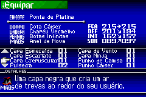
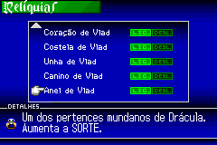
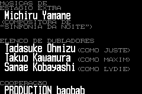
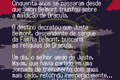

# [GBA] Castlevania - Harmony of Dissonance - Tradução PT-BR

Este é um projeto de tradução do jogo Castlevania - Harmony of Dissonance, de Gameboy Advance, para português do Brasil. O projeto foi feito com base na versão européia do jogo, mas deve funcionar também na americana.

Castlevania - Harmony of Dissonance é um jogo de plataforma com elementos de metroidvania e RPG de ação, desenvolvido pela Konami. É o segundo jogo, dentre os três Castlevanias lançado para Gameboy Advance.

# Informações

Nome do jogo: Castlevania - Harmony of Dissonance

Versão: Européia / Americana

Plataforma: Gameboy Advance

Desenvolvedora: Konami

Distribuidora: Konami

Gênero: Plataforma / Metroidvania / RPG de Ação

Jogadores: 1

# Enredo

Por volta do século XVIII, antes de ter matado Drácula, Simon Belmont foi alvejado por uma maldição do Conde, que o faria morrer a menos que o revivesse. Além disso, anormalmente bestas e demônios vindos do inferno, rondavam Transilvânia, aterrorizando o povo à noite.

Simon novamente obtém o lendário chicote Mata-Vampiros, e vasculha Transilvânia para libertar o povo e procurar pelas relíquias de Drácula, seus restos mortais. Após derrotar inúmeros seres surreais, ele consegue reunir todas as relíquias. Com os restos mortais do Conde em mãos, Simon revive Drácula. Ao lutar com ele novamente, finalmente consegue quebrar tal maldição.

Cerca de meio século depois, Juste Belmont, neto de Simon Belmont, treinava para tornar-se forte e proteger aqueles que ama. Como parceiro de treinamento, havia Maxim Kischine. Com fortes laços de amizade desde a infância, ambos treinavam bastante, e eram também rivais. Havia também uma mulher que era amiga deles desde criança, chamada Lydie Elranger.

O lendário chicote Mata-Vampiros é uma herança exclusiva da linhagem sanguínea dos Belmonts. Apenas membros desta família eram capazes de usá-lo em sua força total. Um único Belmont herda o mesmo, e o destino reserva-lhe provações terríveis. Juste Belmont foi o escolhido, e tornou-se um caçador de vampiros como Simon, seu avô, era outrora.

Vendo que o destino de Juste seria triste e lamentoso, Maxim partiu em jornada. Com o fim de libertá-lo desse destino como caçador, Maxim decide procurar as mesmas relíquias de Drácula que Simon havia reunido cinquenta anos atrás, com o fim de aniquilar o Conde de uma vez por todas.

Dois anos depois, Maxim retorna inesperadamente de sua jornada e vai de encontro a Juste. Com as lembranças dos últimos dois anos perdidas e seu corpo coberto de feridas, Maxim traz más notícias: Lydie foi sequestrada.

Ignorando seus ferimentos, Maxim leva Juste ao local onde, de acordo com suas vagas lembranças, acredita que Lydie está mantida presa. Após atravessar um denso nevoeiro, ambos deparam-se com um castelo sombrio, não documentado em mapa algum à época. Era o castelo de Drácula.

Ao adentrar no castelo, muitas tramas e surpresas lhes aguardam. Será Juste capaz de salvar Lydie? E o que terá acontecido com Maxim no passado após tocar as relíquias de Drácula?

# Sobre a tradução

Comecei essa tradução logo após lançar a versão 1.0 do Aria of Sorrow que lancei no natal de 2006. Estava no canal da Trans-Center e eu planejava passar um tempo sem traduzir. Isso até que Anime_World chegou e propôs criar uma ferramenta em python para extrair/inserir textos de script do jogo. Era orientada a ponteiros, ou seja, extraia e inseria alterando-os frequentemente e de acordo, automatizando todo o trabalho e facilitando a vida do tradutor/romhacker.

Quando ele havia terminado, era janeiro de 2007. Como Harmony of Dissonance era muito parecido com Aria of Sorrow, facilmente encontrei os alfabetos e os acentuei. E lembro-me que umas 3~4 semanas depois já havia traduzido todos os textos (com base [nesse script japonês traduzido pra inglês](https://gamefaqs.gamespot.com/gba/554981-castlevania-harmony-of-dissonance/faqs/17572)), revisados ao meu ver e testados ingame. Estava totalmente funcional. Restava apenas alguém mais além de mim revisar os textos, pois seria bem melhor pra captar erros e sugerir tradução melhor a várias frases/termos. Quem se encarregou disso foi o Darkl0rd.

Infelizmente, essa ferramenta que foi a base desse projeto já não está mais entre nós. O Anime perdeu o código fonte do programa, não sendo possível consertar uns bugs direto por ele. E um tempo depois disso, perdi um de meus HDs, e junto com ele os binários compilados do programa. Nem hospedado em outros locais está. Se o mesmo ainda tivesse vivo, com certeza eu postaria no fórum junto à tradução.

Pouco depois, Odin me auxiliou com os gráficos comprimidos, e então editei todos e testei ingame. Essa foi a parte mais complicada, visto que os gráficos estavam horrivelmente embaralhados, e os tilemaps igualmente. Foram os mais trabalhosos pra mim até então, mas deu pra resolver tudo perfeitamente.

Isso resultou nas versões iniciais da tradução, lançadas lá em 2008. Saindo de lá e indo pra 2024, comecei a revisar algumas traduções antigas de Castlevania, começando pelo Aria of Sorrow e depois Dawn of Sorrow, quando fui contactado por Neko Belmont para inicialmente fazer uma fandublagem pro Aria of Sorrow, o que acabou evoluindo pra uma iniciativa de revisar todas as traduções de Castlevania de gênero Metroidvania que trabalhei no passado. Isso motivou uma revisão no Harmony of Dissonance, que contém diversas atualizações, ajustes e melhorias.

Além do Neko, também tive ajuda de outros novos colegas. Um deles foi o Breno, romhacker novo com grande habilidade em ASM que lançou várias traduções ótimas para GBA, e que criou uma nova ferramenta de dumper/inserter de textos em ARMIPS. Graças a ela, o processo de revisão foi bem mais rápido, prático, e também deu pra facilmente mover os textos pra outros locais da ROM. Outro deles foi o bMatSantos, que me ajudou a inserir uma nova splash-screen da tradução para creditar os envolvidos. Por fim, o denim, que me deu uma mão em uns ajustes na fonte VWF para melhorar a largura de alguns caracteres e a encontrar o tilemap dos créditos finais do jogo.

Essa revisão também conta com a expansão da rom de 8mb para 16mb, seguido de ter todas as alterações textuais e gráficas movidas pro final da região dos 16mb da ROM. Isso foi motivado para aumentar a compatibilidade da tradução com diversos hacks recentes, como "Definitive Edition", "Recolor", "Music Overhaul", "Revenge of the Findesiecle", dentre outros. A grande maioria deles foi feita com [DSVania Editor](https://www.romhacking.net/utilities/1271/), que por padrão usa o espaço livre situada no final da região dos 8mb, o que por vezes conflitava com as alterações da tradução. Com esse ajuste, a chance de acontecer conflitos diminui consideravelmente.

Esta revisão, de 2025, conta com as seguintes novidades:

- Revisão de bestiários, itens e equipáveis, de modo a sincronizar termos com outras traduções.
- Correções textuais pós-reforma gramatical de 2009 (remoção de tremas e outras palavras acentuadas).
- Incluída splash-screen no começo do jogo.
- Tornada a tradução compatível com vários hacks de aprimoramento, tais como:
  - [Recolor](https://www.romhacking.net/hacks/7086/): Aprimora as paletas originais do jogo para tons mais escuros e menos saturados.
  - [Definitive Edition](https://www.romhacking.net/hacks/5575/): Combina vários aprimoramentos gerais menores, como alguns sprites, paletas e elementos de jogabilidade.
  - [Music Overhaul](https://www.romhacking.net/hacks/5483/): Troca todas as músicas originais por outras aprimoradas, seja deste ou de outros jogos.
  - [Revenge of the Findesiecle Deluxe+](https://www.romhacking.net/hacks/5848/): Hack que adiciona vários novos personagens jogáveis, como Julius Belmont do Castlevania Aria of Sorrow, John Morris e Eric Lecarde do Castlevania Bloodlines, etc.

Nos meus testes, os hacks de aprimoramento acima funcionaram muito bem, e eu consegui até mesmo zerar o jogo com o Recolor combinado com a tradução. No entanto, isso pode não ser perfeito, e dependendo do patch, ocorrerem alguns problemas menores. O Revenge of the Findesiecle, por exemplo, apresenta uns bugs visuais menores nos menus, mas que felizmente não comprometem a jogatina.

Com isso, finalizamos essa revisão da tradução antiga de 2008, após mais de 15 anos depois. Espero que usufruam desse trabalho, da mesma forma que também o fizemos nesse processo.

# Equipe

- **Solid One**: Romhacking geral, gráficos, tradução e teste;
- **Anime_World**: Ferramenta de dumper/inserter lá de 2008;
- **Odin**: Extração de gráficos;
- **Darkl0rd**: Revisão inicial lá de 2008;
- **Neko Belmont**: Revisão, gráficos e sugestões do bestiário;
- **Breno**: Nova ferramenta de dumper/inserter em ARMIPS;
- **bMatSantos**: Nova splash-screen;
- **denim**: Romhacking das fontes VWF e dos créditos do jogo;
- **victoriemini**: Artes de capa.

# Status da Tradução

Textos: 100%

Acentos: 100%

Gráficos: 100%

Revisão: 100%

# Perguntas e Respostas

**P1**: O patch pede a rom européia, mas tentei com a americana e por acaso funcionou. Por quê? É normal isso?

**R1**: Normalmente, aplicar patches em versões além da prevista é passível de problemas, mas por sorte, as roms européias e americanas são tão parecidas internamente, que por coincidência os textos e gráficos estão inclusive no mesmo lugar. Só por isso que funcionou. Dito isso, fica por sua conta e risco.

**P2**: Como eu faço para combinar a tradução com os patches de aprimoramento, como Recolor, Definitive Edition e Revenge of the Findesiecle por exemplo?

**R2**: Recomendo que primeiro aplique os patches de aprimoramento, e em seguida o patch de tradução, para ter os melhores resultados. Dessa forma, ambos os assets deverão ser combinados sem conflitarem, e com a tradução sendo aplicada por último, os ponteiros modificados acabam por prevalecer com os valores da tradução, resultando em mais assets traduzidos. Foi desta forma que combinei o Recolor com a tradução, e joguei até o final sem problemas.

**P3**: Vi que a versão nova aumentou o tamanho da ROM de 8mb para 16mb. Por que isso foi feito, se a rom tem espaço de sobra e não precisaria expandir?

**R3**: Isso foi feito para que a tradução seja compatível com a maioria dos hacks, e para que o processo de patching seja simples sem necessitar de uma ferramenta de patcher. Para emuladores isso deve funcionar sem problemas, e chuto que também deva funcionar em hardware real até certo ponto.

**P4**: Tentei combinar o Revenge of the Findesiecle com a tradução. Funcionou, mas percebi vários bugs gráficos e alguns textos não-traduzidos. Isso é normal?

**R4**: Dependendo do hack de aprimoramento usado, alguns podem apresentar bugs menores relacionados aos assets cruzados que foram editados tanto na tradução como no hack. No caso do Revenge of the Findesiecle, ele atualmente está com vários bugs menores nos menus, mas felizmente não faz o jogo crashar. Isso se deu devido às alterações de tilemap da tradução terem sido sobrescritas pelo hack. Possivelmente isso será corrigido no futuro com um patch de addentum, mas sem previsões até o momento.

# Imagens

Versão Original:

  

  

  

  

Versão Recolor:

  

  

  

  

# Patch

O patch de tradução está disponível na seção de releases desse repositório. Está em formato IPS, e vocês podem aplicá-los através de programas como [Floating IPS](https://www.romhacking.net/utilities/1040/) ou similares.

Esta tradução pode ser aplicada na ROM "Castlevania - Harmony of Dissonance (E) [!].gba", com CRC32 521B3091, na ROM "Castlevania - Harmony of Dissonance (E) [h1C].gba", com CRC32 6D14E739, na ROM "Castlevania - Harmony of Dissonance (E) [hIR00].gba", com CRC32 E1E8823A, ou na ROM "Castlevania - Harmony of Dissonance (E) [hI].gba", com CRC32 6EFB2B6E (todas com código ACHP).Também pode ser aplicada sem problemas na ROM "Castlevania - Harmony of Dissonance (U) [!].gba" (código ACHE), com CRC32 88C1B562, apesar de não ser a versão originalmente utilizada.